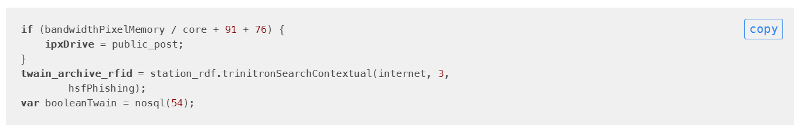

# Grav Markdown Clipboard Plugin

**Markdown Clipboard** is a [Grav](http://github.com/getgrav/grav) plugin that adds the simple `copy to clipboard` functionality utilizing the jQuery plugin [ClipboardJS](https://clipboardjs.com/).

Demo available on [ClipboardJS](https://clipboardjs.com/) website, or on the [Grav Doc](https://learn.getgrav.org/).



# Manual installation

Download the latest [release](https://github.com/StellarisStudio/grav-plugin-markdown-clipboard/releases)  of this repository, unzip to `/your-grav/user/plugins` and rename the folder to `markdown-clipboard`.

# Configuration and Usage

The `markdown-clipboard.yaml` file contains only two settings :<br>
`enabled: true` which turns the plugin on/off.<br>
`built_in_css: true` which activate the default plugin CSS.

Nothing to do, this plugin only inject a CSS and a JS file into your grav page!

# Extra Config

If you use a theme or another plugin (such as [Xtra Features](https://github.com/StellarisStudio/grav-plugin-xtrafeatures) which contains the Font Awesome, you can change the word "copy" to use an icon. In the JS folder, open the `clipboard.min.init.js` file in which you will find, at the bottom, the ClipboardJS inception code!.<br>
_(example with [Font Awesome 5](https://fontawesome.com/))_

```js
Line 19, button.textContent = 'copy';
Change it to : button.innerHTML = '<i class="fas fa-paste"></i>';
```
```js
Line 34, event.trigger.textContent = 'copied';
Change it to : event.trigger.innerHTML = '<i class="fas fa-clipboard-check"></i>';
```
```js
Line 36 & 45, event.trigger.textContent = 'copy';
Change it to : event.trigger.innerHTML = '<i class="fas fa-paste"></i>';
```

# License

MIT license. See [LICENSE](LICENSE)
